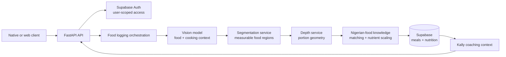
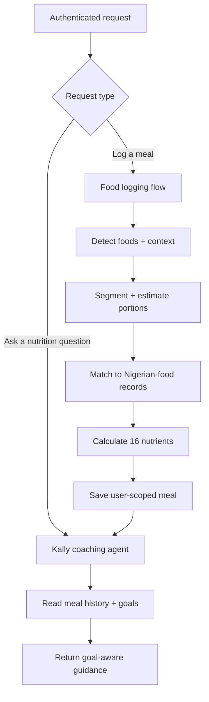

# Kalnur Backend 🥗

> A self-hostable AI nutrition backend for photo-based food logging, designed
> around Nigerian meals, nutrition data, and health goals.

**This repository is the open backend reference implementation of
[Kalnur](https://kalnur.com)** — the mother product where the full Kalnur
experience lives. Visit [kalnur.com](https://kalnur.com) to experience the
product. This repository exists so developers can study, run, and extend the
technical system using their own infrastructure and provider keys.

> 📱 **Try Kalnur on a phone for the intended experience.** The live product is
> designed first for the mobile flow, including photo-based food logging and
> personalised coaching.

Kalnur turns a meal photo into structured food items, estimated portions,
16-nutrient totals, and goal-aware coaching. This repository is the backend
reference implementation. Bring your own model-provider keys, Supabase project,
and (for image portions) Modal endpoints.

> Nutrition results are estimates for education and self-tracking. Kalnur is not
> medical advice, diagnosis, or treatment.

## What is included

- FastAPI API with Supabase Auth-backed accounts and user-scoped records.
- Photo logging: vision detection, segmentation, depth-derived portions, and
  Nigerian-food nutrition matching.
- 16 nutrients: calories, protein, carbohydrates, fat, fiber, iron, calcium,
  zinc, potassium, sodium, magnesium, vitamins A/C/D/B12, and folate.
- Kally, a coaching assistant with meal history and nutrition context.
- Supabase PostgreSQL + pgvector schema, food data, and database hardening SQL.
- Docker deployment configuration and Modal workers for SAM 2 segmentation and
  Depth Anything V2 portion support.

## How the system works 🧭



This is an orchestrated AI workflow. Image analysis and nutrition retrieval are
specialised stages with explicit inputs and outputs; Kally is the conversational
coaching component that uses the resulting user context.

### Agentic orchestration



The orchestration is deliberately staged rather than a single opaque model call:
each step can be inspected, swapped, timed, and evaluated independently.

For the current engineering evaluation of the two vision/segmentation paths,
read [the evaluation report](docs/evaluations/pipeline-evaluation.md). 📊

## Before you start

You need:

- Python 3.11
- a Supabase project you own
- an OpenAI API key (used for the default vision/embedding paths)
- a DeepSeek key if you enable Kally chat
- deployed segmentation and depth endpoints if you enable photo portions

Optional integrations include AWS Bedrock, Tavily, Resend, and web-push VAPID.
They are not required to inspect the API or develop the core service.

## Quick start

```bash
git clone https://github.com/YOUR-ACCOUNT/kalnur-backend.git
cd kalnur-backend

python -m venv .venv
source .venv/bin/activate
pip install -r requirements.txt

cp .env.example .env
```

Fill in `.env` with credentials for **your own** services. Never use another
deployment's Supabase URL, service-role key, model-provider key, or Modal URL.

Start the API:

```bash
uvicorn kai.api.server:app --reload --port 8000
```

Open `http://localhost:8000/docs` to explore the local API.

## Set up Supabase securely

The backend uses the Supabase service-role key only on the server. Do not put it
in a mobile app, browser bundle, public environment variable, or repository.

1. Create a new Supabase project for this deployment.
2. In the SQL Editor, apply the schema files in this order:

   ```text
   db/supabase_migration.sql
   db/add_user_coaching.sql
   db/add_missing_foods.sql
   db/add_native_push_tokens.sql
   db/enable_rls.sql
   ```

3. Set `SUPABASE_URL`, `SUPABASE_ANON_KEY`, and the server-only
   `SUPABASE_SERVICE_ROLE_KEY` in `.env`.
4. Seed the included Nigerian-food knowledge-base source into **your** project.
   This creates embeddings with your OpenAI key and can incur provider cost:

   ```bash
   python reinitialize_chromadb.py
   ```

5. Keep client applications talking to this API rather than directly to the
   project database. `db/enable_rls.sql` enables Row Level Security and revokes
   direct Data API access for anonymous and authenticated client roles.

The included food data is source data, not a link to Kalnur's production
database. You control the Supabase project and data used by your deployment.

## Deploy segmentation and depth services

The main API expects URLs for services you deploy:

```text
SAM_SEGMENTATION_URL=
DEPTH_ESTIMATION_URL=
```

For the optional comparison route, set `SAM3_SEGMENTATION_URL` as well. The
evaluation keeps this alternative explicit rather than silently sending both
vision models through the same segmentation service.

The `modal/` directory contains the reference Modal applications. Configure
their provider secrets in Modal, deploy them to your account, and place only
your resulting endpoint URLs in `.env`. Do not make paid GPU endpoints openly
callable without authentication or request limits.

You can also run the backend without these URLs while building non-image
features. Treat image analysis as an integration that needs its own cost,
latency, and privacy review.

## Operations and evaluation endpoints

The vision comparison endpoints are disabled by default. To use them in a
private development environment, set `OPERATIONS_API_KEY` and pass the same
value as `X-Operations-Key`. These routes can invoke paid providers and must
not be exposed as a public demo endpoint.

## Security model

- `.env`, key files, virtual environments, model checkpoints, and benchmark
  artefacts are ignored by Git.
- All database access from the API uses the server-side service role; clients
  never receive it.
- `db/enable_rls.sql` enables RLS, removes direct client grants, and leaves the
  nutrition knowledge base server-managed.
- Browser CORS is configured through `ALLOWED_ORIGINS`; set explicit deployed
  origins instead of `*`.
- Rotate a credential immediately if it is committed, logged, or shared.

Read [SECURITY.md](SECURITY.md) before deploying a public instance.

## Current model work 🔬

The stable code path uses GPT-4o for vision, SAM 2 for segmentation, and Depth
Anything V2 for portion support. Kalnur also has an ongoing evaluation track for
Claude on Bedrock and text-prompted SAM 3. These experiments are not presented
as production accuracy claims: a labelled, weighed Nigerian-meal dataset is
needed to validate food detection, portion error, calorie error, cost, and
latency before promotion.

The public evaluation report records the observed engineering behaviour,
including an identified and corrected double-counting failure. It does **not**
claim that either pipeline is more nutritionally accurate without weighed
ground truth.

## Contributing

See [CONTRIBUTING.md](CONTRIBUTING.md). Please do not submit secrets, user meal
images, customer exports, or unreviewed benchmark artefacts in an issue or pull
request.

## License

MIT. See [LICENSE](LICENSE).
